# 🚀 E-commerce EKS Infrastructure

Complete AWS EKS infrastructure deployment using Terraform for a production-ready e-commerce platform.

## Table of Contents

- [Overview](#overview)
- [Architecture](#architecture)
- [Prerequisites](#prerequisites)
- [Project Structure](#Project-Structure)
- [Infrastructure Components](#infrastructure-components)
- [Deployment Steps](#deployment-steps)
- [Verification](#verification)
- [Accessing the Cluster](#accessing-the-cluster)
- [Troubleshooting](#troubleshooting)
- [Cost Estimation](#cost-estimation)
- [Security Best Practices](#security-best-practices)
- [Clean Up](#clean-up)
- [Contributing](#contributing)


---

## 🎯 Overview

This project provisions a complete Kubernetes infrastructure on AWS EKS with the following features:

- **Multi-AZ deployment** for high availability
- **Private worker nodes** for enhanced security
- **AWS Load Balancer Controller** for automatic ALB provisioning
- **EBS CSI Driver** for persistent storage
- **IRSA (IAM Roles for Service Accounts)** for secure AWS API access
- **Managed node groups** 

---

## 🏗️ Architectures


### Network Architecture

```


Internet
    ↓
Internet Gateway
    ↓
Public Subnets (2 AZs)
    ├── NAT Gateway
    └── Application Load Balancers
        ↓
Private Subnets (2 AZs)
    └── EKS Worker Nodes
        └── Pods (Your Applications)
```

### Infrastructure Diagram

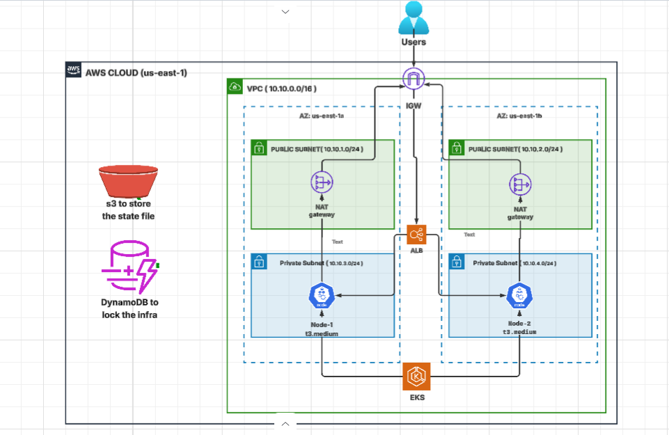

### TRAFFIC FLOW  && KEY COMPONENTS
```

╔════════════════════════════════════════════════════════════════════════╗
║                             TRAFFIC FLOW                               ║
╠════════════════════════════════════════════════════════════════════════╣
║  1. Users → Internet Gateway                                           ║
║  2. Internet Gateway → ALB (in Public Subnets)                         ║
║  3. ALB → EKS Nodes (in Private Subnets)                               ║
║  4. EKS Nodes → Pods (Your Applications)                               ║
║  5. Pods → NAT Gateway (for outbound internet access)                  ║
║  6. EKS Control Plane ← → Nodes (Management & Scheduling)              ║
╚════════════════════════════════════════════════════════════════════════╝

╔════════════════════════════════════════════════════════════════════════╗
║                          KEY COMPONENTS                                ║
╠════════════════════════════════════════════════════════════════════════╣
║  🔴 Public Subnets:  Internet-facing resources (ALB, NAT)              ║
║  🟢 Private Subnets: Protected resources (EKS Nodes, Pods)             ║
║  🚪 Internet Gateway: Allows inbound/outbound internet access          ║
║  🔀 NAT Gateway:     Allows private subnets to access internet         ║
║  ⚖️  ALB:            Routes traffic to pods based on Ingress rules     ║
║  ☸️  Control Plane:  Manages cluster, schedules pods (AWS Managed)     ║
║  🔐 IRSA:           IAM Roles for Service Accounts (secure access)     ║
╚════════════════════════════════════════════════════════════════════════╝
```

### Component Summary

**Network Layer:**
- VPC with CIDR `10.10.0.0/16`
- 2 Public Subnets (for ALBs and NAT)
- 2 Private Subnets (for EKS nodes)
- Internet Gateway & NAT Gateway

**Compute Layer:**
- EKS Control Plane (AWS Managed, v1.30)
- 2x t3.medium EC2 instances (Managed Node Group)

**Security Layer:**
- OIDC Provider for IRSA
- IAM Roles for Service Accounts (ALB Controller, EBS CSI Driver)
- Admin Access Entry for cluster management
- Security Groups and Network ACLs

**Application Layer:**
- AWS Load Balancer Controller (Helm chart)
- EBS CSI Driver for persistent storage
- CoreDNS for service discovery
- VPC CNI for pod networking
- Kube-proxy for service routing

**Console Screenshot**

- VPC Console Screenshot:

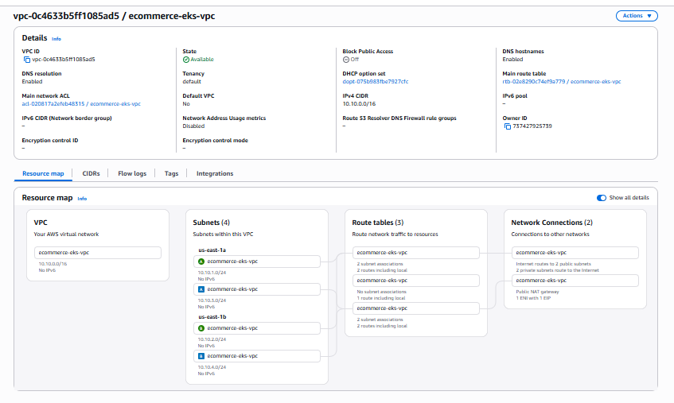

- EKS Console Screenshot:

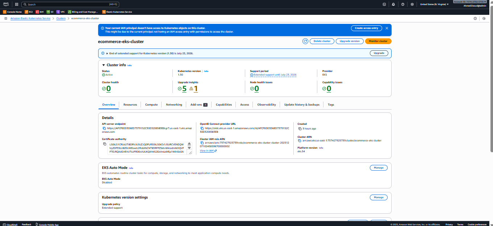

Nodes Console Screenshot:
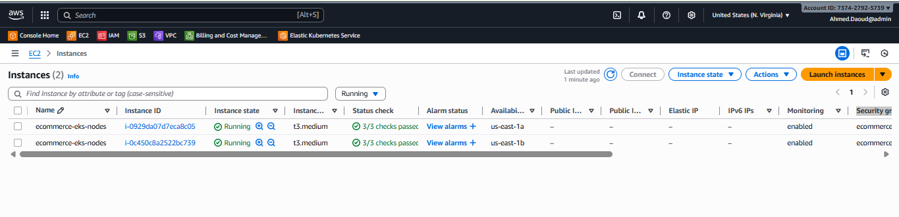

### Terraform Resources Flow

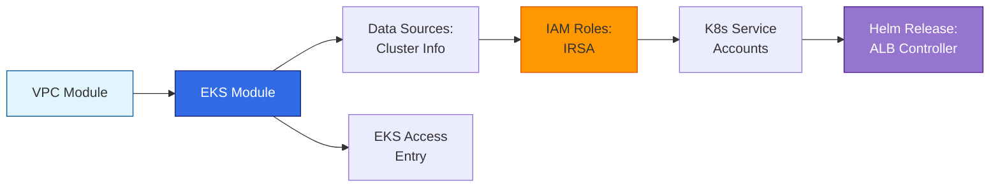

**Creation Order:**
1. **VPC** → Creates network infrastructure
2. **EKS Cluster** → Creates control plane and nodes
3. **Data Sources** → Fetches cluster endpoint and auth
4. **IAM Roles** → IRSA roles for EBS CSI and ALB Controller
5. **K8s Service Accounts** → Links IAM roles to pods
6. **Helm Charts** → Deploys ALB Controller
7. **Access Entries** → Grants admin user permissions

---

## 📦 Prerequisites

### Required Tools

|     Tool     | Version | Purpose                       |
|--------------|---------|-------------------------------|
| **Terraform**| ≥ 1.5.0 | Infrastructure provisioning   |
| **AWS CLI**  | ≥ 2.0   | AWS API interactions          |
| **kubectl**  | ≥ 1.28  | Kubernetes management         |
| **Helm**     | ≥ 3.0   | (Optional) Package management |

### AWS Requirements

1. **AWS Account** with appropriate permissions
2. **IAM User/Role** with the following policies:
   - `AmazonEKSClusterPolicy`
   - `AmazonEKSWorkerNodePolicy`
   - `AmazonEC2FullAccess`
   - `IAMFullAccess`
   - `AmazonVPCFullAccess`

3. **AWS CLI configured** with credentials:
```bash
aws configure
# Enter your Access Key ID, Secret Access Key, Region, and Output format
```

---
## Project Structure

```
.
├── main.tf           # Main infrastructure definition
├── providers.tf      # Provider configurations
├── variables.tf      # Input variables
├── outputs.tf        # Output values
├── terraform.tfvars  # Variable values (create this file)
└── README.md         # This file
```

---

## 🧩 Infrastructure Components

### VPC Configuration

- **CIDR Block:** `10.10.0.0/16` (65,536 IPs)
- **Availability Zones:** us-east-1a, us-east-1b
- **Public Subnets:** 
  - `10.10.1.0/24` (us-east-1a)
  - `10.10.2.0/24` (us-east-1b)
- **Private Subnets:**
  - `10.10.3.0/24` (us-east-1a)
  - `10.10.4.0/24` (us-east-1b)
- **NAT Gateway:** Single NAT (cost optimization)

### EKS Cluster

- **Cluster Name:** `ecommerce-eks-cluster`
- **Kubernetes Version:** 1.30
- **Control Plane:** AWS Managed
- **OIDC Provider:** Enabled (for IRSA)
- **Endpoint Access:** Public

### Node Group

- **Name:** `ecommerce-eks-nodes`
- **Instance Type:** t3.medium (2 vCPU, 4 GB RAM)
- **Desired Capacity:** 2 nodes
- **Min Size:** 2 nodes
- **Max Size:** 4 nodes
- **AMI Type:** AL2_x86_64 (Amazon Linux 2)
- **Disk Size:** 20 GB per node

### Add-ons

| **Add-on**         | Version | Purpose                     |
|--------------------|---------|-----------------------------|
| **EBS CSI Driver** | Latest  | Persistent storage for pods |
| **VPC CNI**        | Latest  | Pod networking              |
| **CoreDNS**        | Latest  | DNS resolution              |
| **kube-proxy**     | Latest  | Network proxy               |

### AWS Load Balancer Controller

- **Version:** 1.8.1
- **Deployment:** Helm chart
- **Purpose:** Automatically provisions ALBs/NLBs for Kubernetes Ingress resources


---


## 🚀 Deployment Steps

### Step 1: Pre-deployment Checklist

- [ ] AWS credentials configured
- [ ] IAM user has required permissions
- [ ] Terraform installed and working
- [ ] Variables customized (especially `admin_user_arn`)

### Step 2: Initialize Terraform

```bash
terraform init
```
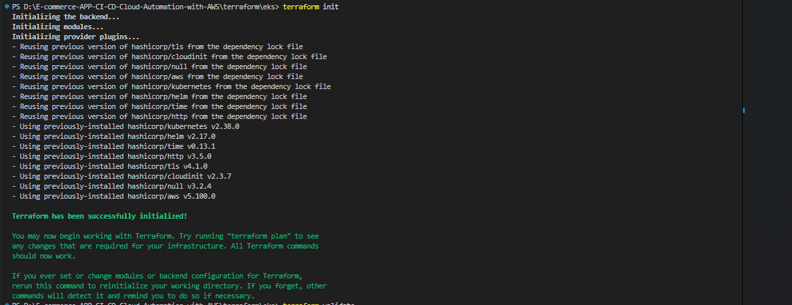

**What happens:**
- Downloads required provider plugins (AWS, Kubernetes, Helm)
- Initializes backend configuration
- Prepares working directory
-

### Step 3: Validate Configuration

```bash
terraform validate
```
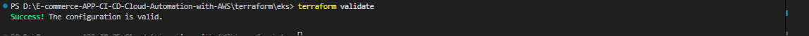
### Step 4: Plan Deployment

```bash
terraform plan -out=tfplan
```
**Review:**

- Number of resources to be created (~ 67 resources)
- VPC and subnet configurations
- EKS cluster settings
- IAM roles and policies

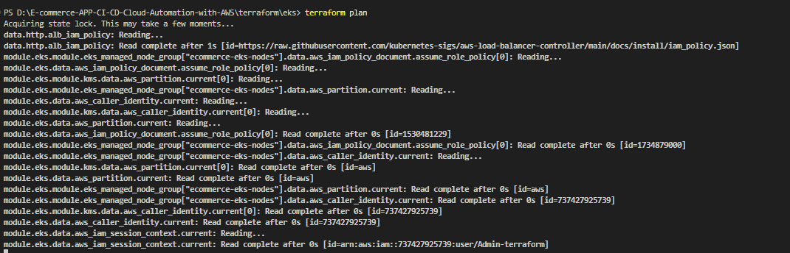

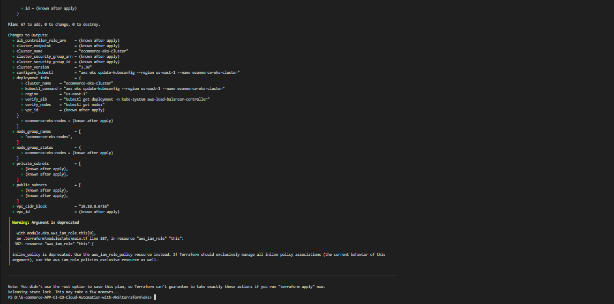


### Step 5: Apply Configuration

```bash
terraform apply tfplan
```
**Deployment stages:**
1. VPC and networking (2-3 minutes)
2. EKS control plane (8-10 minutes)
3. Node group (3-5 minutes)
4. Add-ons and ALB controller (2-3 minutes)
 **Expected deployment time:** 15-20 minutes

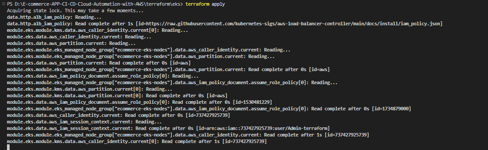

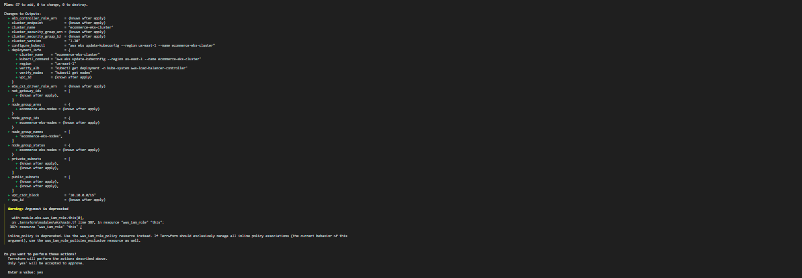


 **Terraform apply complete**
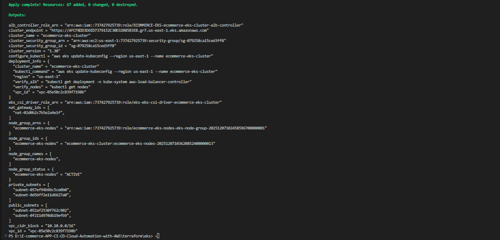

### Step 6: Save Outputs

```bash
terraform output > outputs.txt
```
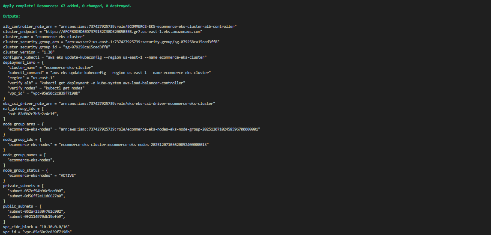

---

## ✅ Verification

### 1. Verify AWS Resources

#### Check EKS Cluster

```bash
aws eks describe-cluster --name ecommerce-eks-cluster --region us-east-1
```
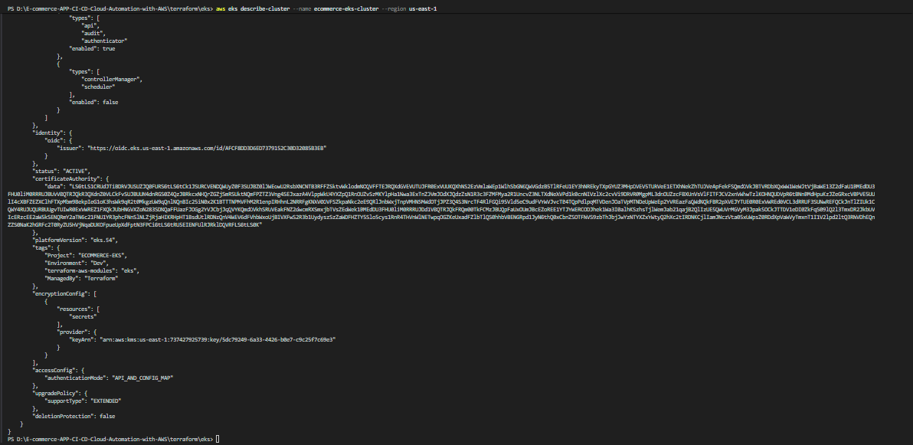

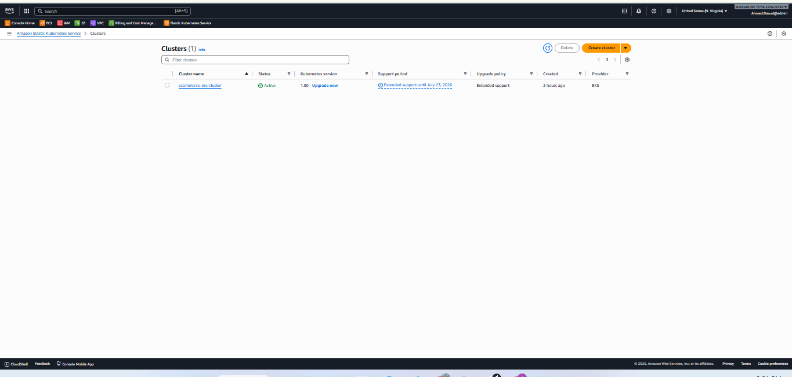

#### Check Node Group

```bash
aws eks describe-nodegroup --cluster-name ecommerce-eks-cluster --nodegroup-name ecommerce-eks-nodes --region us-east-1
```


### 2. Configure kubectl

```bash
aws eks update-kubeconfig --region us-east-1 --name ecommerce-eks-cluster
```


### 3. Verify Cluster Access

```bash
kubectl cluster-info
```
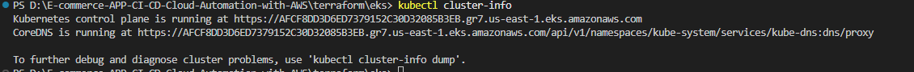


### 4. Check Nodes

```bash
kubectl get nodes
```
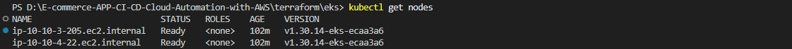


### 5. Verify System Pods

```bash
kubectl get pods -n kube-system
```
**Check for:**
- `aws-load-balancer-controller` (2 replicas)
- `ebs-csi-controller` (2 replicas)
- `coredns` (2 replicas)
- `aws-node` (one per node)
- `kube-proxy` (one per node)

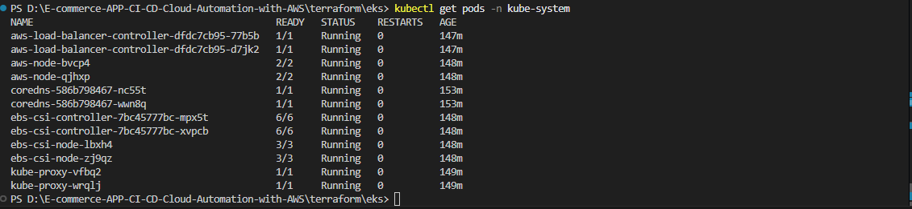

### 6. Verify ALB Controller

```bash
kubectl get deployment -n kube-system aws-load-balancer-controller
```
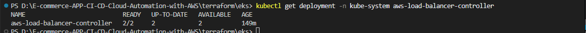

### 7. Check Logs (if needed)

```bash
kubectl logs -n kube-system deployment/aws-load-balancer-controller
```

---

## 🔐 Accessing the Cluster

### Method 1: Using AWS CLI (Recommended)

```bash
# Configure kubectl
aws eks update-kubeconfig --region us-east-1 --name ecommerce-eks-cluster

# Verify access
kubectl get svc
```

### Method 2: Using kubeconfig manually

```bash
# Get cluster endpoint
export CLUSTER_ENDPOINT=$(terraform output -raw cluster_endpoint)

# Get cluster CA
terraform output cluster_certificate_authority_data > ca.crt

# Get token
export TOKEN=$(aws eks get-token --cluster-name ecommerce-eks-cluster --region us-east-1 | jq -r .status.token)
```


## 🔧 Troubleshooting


### Issue 1: ALB Controller Not Creating Load Balancers

**Symptoms:**
- Ingress created but no ALB appears

**Solution:**
```bash
# Check controller logs
kubectl logs -n kube-system deployment/aws-load-balancer-controller

# Verify IAM role
aws iam get-role --role-name eks-alb-controller-ecommerce-eks-cluster

# Check subnet tags
aws ec2 describe-subnets --subnet-ids $(terraform output -json public_subnets | jq -r '.[]')
```


### Issue 2: Permission Denied When Running kubectl

**Symptoms:**
```
error: You must be logged in to the server (Unauthorized)
```

**Solution:**
```bash
# Update kubeconfig
aws eks update-kubeconfig --region us-east-1 --name ecommerce-eks-cluster

# Verify IAM user is correct
aws sts get-caller-identity

# Check EKS access entries
aws eks list-access-entries --cluster-name ecommerce-eks-cluster
```
---

## 💰 Cost Estimation

### Monthly Cost Breakdown (us-east-1)

| Component                     | Quantity        | Unit Cost       | Monthly Cost |
|-------------------------------|-----------------|-----------------|--------------|
| **EKS Control Plane**         | 1 cluster       | $0.10/hour      | ~$73         |
| **EC2 Instances (t3.medium)** | 2 nodes         | $0.0416/hour    | ~$60         |
| **NAT Gateway**               | 1 gateway       | $0.045/hour     | ~$32         |
| **NAT Gateway Data**          | 100 GB          | $0.045/GB       | ~$5          |
| **EBS Volumes (gp2)**         | 40 GB           | $0.10/GB-month  | ~$4          | 
| **Application Load Balancer** | 1 ALB           | $0.0225/hour    | ~$16         |
| **ALB LCU Hours**             | Variable        | $0.008/LCU-hour | ~$6          |
| | | **Total**                 | **~$196/month** |

### Cost Optimization Tips

1. **Use Spot Instances** for non-production workloads (save 60-70%)
2. **Implement Cluster Autoscaler** to scale down during low usage
3. **Use single NAT Gateway** (already configured)
4. **Reserved Instances** for production (save 30-40%)
5. **Right-size your nodes** based on actual usage

---

## 🔒 Security Best Practices

### Implemented Security Features

✅ **Network Security**
- Private subnets for worker nodes
- Security groups with least privilege
- NAT Gateway for outbound traffic only

✅ **IAM Security**
- IRSA (IAM Roles for Service Accounts)
- Separate roles for each component
- Principle of least privilege

✅ **Cluster Security**
- EKS Access Entries (instead of aws-auth ConfigMap)
- Pod Security Standards ready
- Network policies ready (requires network policy controller)


---

## 🗑️ Clean Up

### Delete All Resources

```bash
# Delete all Kubernetes resources first
kubectl delete ingress --all --all-namespaces
kubectl delete svc --all --all-namespaces --field-selector metadata.name!=kubernetes

# Wait for ALBs to be deleted (check AWS Console)

# Destroy Terraform resources
terraform destroy
```

**Type `yes` when prompted.**

### Verify Deletion

```bash
# Check EKS cluster is gone
aws eks describe-cluster --name ecommerce-eks-cluster --region us-east-1
# Should return: ResourceNotFoundException

# Check VPC is deleted
aws ec2 describe-vpcs --filters "Name=tag:Name,Values=ecommerce-eks-vpc"
# Should return: Empty
```

### Manual Cleanup (if needed)

If `terraform destroy` fails:

1. **Delete Load Balancers manually**
```bash
aws elbv2 describe-load-balancers --query 'LoadBalancers[?VpcId==`vpc-xxx`].LoadBalancerArn'
```

2. **Delete Security Groups manually**
```bash
aws ec2 describe-security-groups --filters "Name=vpc-id,Values=vpc-xxx"
```

3. **Retry terraform destroy**
```bash
terraform destroy -auto-approve
```
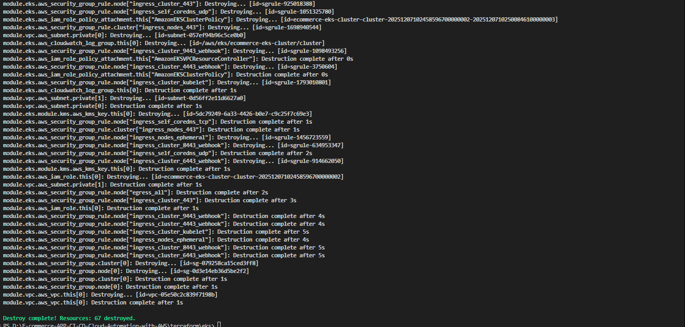
---

## 📚 Additional Resources

- [AWS EKS Documentation](https://docs.aws.amazon.com/eks/)
- [Terraform AWS Provider](https://registry.terraform.io/providers/hashicorp/aws/latest/docs)
- [AWS Load Balancer Controller](https://kubernetes-sigs.github.io/aws-load-balancer-controller/)
- [EBS CSI Driver](https://github.com/kubernetes-sigs/aws-ebs-csi-driver)
- [Kubernetes Documentation](https://kubernetes.io/docs/)

---
